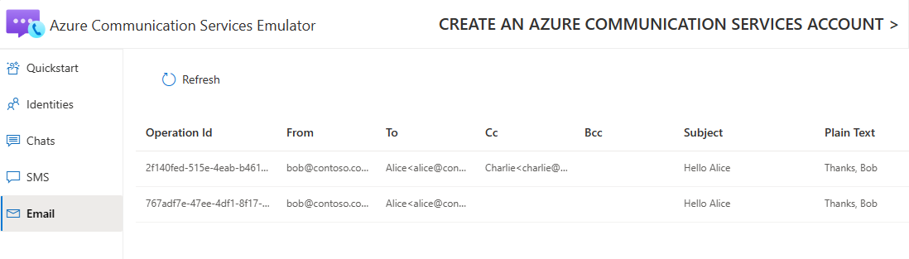

# Emulator for Azure Communication Services
Local emulator to run Azure Communication Services client SDKs without having to provision an Azure Communication Services resource.

## Download the emulator CLI tool

### Install from GitHub

Make sure you have the .NET Core SDK installed, download the latest [AcsEmulatorCLI Release](https://github.com/DominikMe/acs-emulator/releases) and then run from a terminal:

```dotnetcli
dotnet tool install -g --add-source [downloadFolder] AcsEmulatorCLI --version [nupkgVersion]
```

### Running the tool

**Usage:**

`acs-emulator [command] [options]`

**Commands:**

| Command            | Description                      |
| ------------------ | -------------------------------- |
|  `--version `        | Show version information
|  `-?, -h, --help`    | Show help and usage information |
|  `run`               | Run the emulator. |
|  `openApi`           | Open the emulator's API in Swagger UI. |
|  `openDB`            | Open the emulator's sqlite database.         |
|  `openUI`            | Open the emulator UI. |
|  `clean`             | Clean all data and reset the emulator state. |
|  `connectionString`  | Get the ACS connection string for the emulator. |
|  `repo`              | Open code repository. |

## Using the emulator

* You can use the `Try it` feature in the Swagger editor under `https://localhost/swagger` to send requests against the API

* Use `"endpoint=https://localhost/;accessKey=pw=="` as your connection string when instantiating Azure Communication Services SDK service clients.

* Use the Identity SDK with the localhost connection string and create users and tokens as usual. Use the created token to instantiate the Chat SDK.

* When running the JavaScript SDKs with Node.JS add `NODE_TLS_REJECT_UNAUTHORIZED="0"` as an env variable

* You can also use endpoint `https://localhost/` to run the Live Preview of the UI library's [Chat composite](https://azure.github.io/communication-ui-library/?path=/story/composites-chat-joinexistingchatthread--join-existing-chat-thread). First, create two users with tokens and use one of the users to create a chat thread with the other user. Then, you can open two tabs side by side and fill in the the respective user, token, thread id and endpoint for each.

* You can browse the emulator data under `http://localhost:3000`



* For inspecting the DB data directly, we recommend to install [DB Browser for SQLite](https://sqlitebrowser.org/) and use it to open the `AcsEmulator.db` file

## Getting started with code

* Install the `dotnet ef` tool: Run `dotnet tool install --global dotnet-ef` [Link for details](https://docs.microsoft.com/en-us/ef/core/cli/dotnet)

* Run `dotnet ef database update` to update your local copy of the `AcsEmulator.db` in case new migrations were added.

* Build and run the `AcsEmulatorApi` project

* Build the emulator UI by navigating to `acs-emulator-ui`, then run `npm install` and `npm run start`

* To build a new version of the CLI tool, first build the `acs-emulator-ui` with `npm run build` to build production bundles. Then build the `AcsEmulatorCLI` project (in the `Release` flavor)

* For inspecting the DB data directly, we recommend to install [DB Browser for SQLite](https://sqlitebrowser.org/) and use it to open the `AcsEmulator.db` file

* To reset the emulator entirely and clear its data and state, delete the `AcsEmulator.db` file

## Enable real-time notifications for Chat

The URL for establishing the real-time notification channel, is unfortunately hard-coded in the Azure SDK. To enable real-time notifications in the emulator follow these steps (requires rebuilding the emulator from source):

1. Add `127.0.0.1 go.trouter.teams.microsoft.com` to your machine's hosts file to redirect the SDK's hard-coded URL to your localhost.

1. Run `createSelfSignedCert.ps1`

1. Install the generated `acsEmulator_selfSigned.pfx` in your certificate store under Trusted Root Certification Authorities using password `mypassword`. Please uninstall the cert when no longer needed, we're hoping to get rid of the need to install a self-signed cert soon and fully rely on the ASP.NET Core HTTPS development certificate instead.

1. Relaunch your browser to load the newly installed root certificate.

1. Add the following as a top property of `appsettings.json`:

```json
"Kestrel": {
  "Endpoints": {
    "HttpsInlineCertFile": {
      "Url": "https://localhost",
      "Certificate": {
        "Path": "acsEmulator_selfSigned.pfx",
        "Password": "mypassword"
      }
    }
  }
},
```

6. Rebuild and launch `AcsEmulatorAPI`.

7. Restart all browsers to load the new root cert.

8. Run the `AcsEmulatorApi` project to start the emulator.

Now, the Chat SDK can establish a real-time notification channel which is backed by a websocket connection in the emulator's ASP .NET Core service.

## Limitations

* Only a subset of APIs have been implemented so far:
  * `/identities`
  * `/chat`
  * `/email`
  * `/sms`
  * EventGrid events for Sms
* All server/control-plane APIs are unauthenticated (HMAC / AAD is ignored)
* API versioning is ignored, the implemented APIs are trying to be on a recent version
* `/chat` APIs are incomplete
  * token scope `chat` is not enforced
  * read receipts aren't implemented
  * only `messageReceived` and typing real-time notifications are implemented so far
